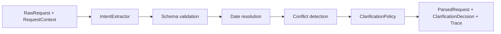

# Architecture Overview

## Eventual workflow

`Raw request -> Parse request -> Clarify constraints -> Plan searches -> Run provider tools -> Normalize and validate -> Rank candidates -> Explain recommendations`

## Current request-understanding boundary

The current slice stops after request interpretation and clarification selection. It may use model-based semantic extraction, but deterministic code remains responsible for validation, date logic, conflict checks, and clarification policy.

## Responsibility table

| Responsibility | Current owner | Reason |
| --- | --- | --- |
| Semantic extraction | model | Natural-language interpretation is the core semantic task. |
| Ambiguity identification | model | Ambiguity detection depends on language understanding and uncertainty recognition. |
| Date arithmetic | deterministic code | Exact temporal logic must be reproducible and testable. |
| Schema validation | deterministic code | Contract enforcement should not depend on model behavior. |
| Conflict detection | deterministic code | Contradiction checks need explicit, auditable rules. |
| Clarification selection | deterministic policy | Asking at most one focused question should follow stable policy. |
| Search planning | deferred | Outside the current milestone. |
| Provider calls | deferred | Outside the current milestone. |
| Ranking | deferred | Outside the current milestone. |
| Final explanation | deferred | Outside the current milestone. |

## Provisional current-slice diagram

This diagram is provisional and only describes the current request-understanding slice.
