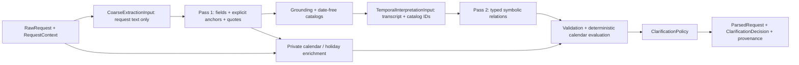

# Architecture Overview

## Eventual workflow

`Raw request -> Parse request -> Clarify constraints -> Plan searches -> Run provider tools -> Normalize and validate -> Rank candidates -> Explain recommendations`

## Current request-understanding boundary

The current slice stops after request interpretation and clarification selection. It uses two model
passes separated by a deterministic trust checkpoint, and it uses Nager.Holidays as the source for
U.S. federal-holiday calendar dates. Pass one receives request text only and extracts non-temporal
fields, literally named anchors, and claim-linked exact temporal quotes. Deterministic code grounds
evidence, assigns canonical evidence and anchor IDs, privately enriches explicit anchors, and builds
an allowed symbolic-reference catalog. Pass two receives only the bounded temporal transcript and
those date-free catalogs, then emits typed semantic temporal relations. Deterministic code validates
and evaluates the relations into exact date windows before conflict and clarification policy.

## Responsibility table

| Responsibility | Current owner | Reason |
| --- | --- | --- |
| Coarse semantic extraction | first model pass | Natural-language interpretation is the core semantic task. |
| Ambiguity identification | model | Ambiguity detection depends on language understanding and uncertainty recognition. |
| Explicit airport-code preservation | deterministic code | A model-classified verbatim IATA code is already a stable downstream identifier. |
| Holiday calendar dates | `HolidayDateProvider` | Nager.Holidays API v4 supplies U.S. federal-holiday anchors. |
| Temporal relation interpretation | second model pass | Linguistic targets, references, directions, ordinals, weekdays, units, and ambiguity require semantic interpretation. |
| Calendar evaluation | deterministic code | Holiday windows, weekends, weekdays, offsets, month portions, durations, and final ranges must be reproducible. |
| Dependency/reference validation | deterministic code | Anchor existence, request-field ordering, and cycles are exact graph invariants. |
| Schema validation | deterministic code | Contract enforcement should not depend on model behavior. |
| Evidence span resolution | deterministic code | Quotes must match the immutable request exactly; offsets and ambiguity handling must be reproducible. |
| Evidence, anchor, and symbolic-reference catalogs | deterministic code | Stable IDs and allowed membership form the trust boundary between model passes. |
| Claim/evidence sufficiency evaluation | deterministic code | Allowed envelopes and required fragments are fixture-defined correctness rules. |
| Conflict detection | deterministic code | Contradiction checks need explicit, auditable rules. |
| Clarification selection | deterministic policy | Asking at most one focused question should follow stable policy. |
| Point balances and spending budgets | deferred | Excluded from MVP extraction, parsed output, and clarification policy. |
| Search planning | deferred | Outside the current milestone. |
| Travel-provider calls | deferred | Outside the current milestone. |
| Ranking | deferred | Outside the current milestone. |
| Final explanation | deferred | Outside the current milestone. |

## Provisional current-slice diagram

The `RawRequest` and its context remain inside deterministic orchestration. Neither model pass sees a
concrete reference date, timezone, resolved anchor boundary, holiday-provider metadata, or inferred
calendar value. Pass two may see the symbolic key `context:request_date`, but not its date value. It
selects only supplied evidence IDs, explicit-anchor IDs, and symbolic-reference keys. `next month`
therefore remains a symbolic whole-calendar-period relation until deterministic evaluation;
`next spring` remains unresolved because no deterministic season policy is approved.

The holiday lookup is only exercised for holiday anchors. Exact-date and month anchors do not call
Nager.Holidays. API failures and invalid responses surface as explicit errors; there is no
hand-coded success fallback. Unit tests inject fake model passes and a fake provider and do not
require network access.

The retained `DateResolutionProposal` in `ParsedRequest` is generated after deterministic graph
evaluation for trace and historical scorer compatibility. It is not accepted from the second model
pass. The authoritative internal semantic contract after adapter conversion is
`TemporalRelationGraph`.

The Responses API transport uses fixed per-relation collections with required item fields and no
unsupported `oneOf`. It is deliberately separate from the internal domain graph. The adapter checks
catalog membership and converts each collection into the typed internal relations without weakening
downstream validation. Details of the information boundary and current-flow audit are in ADR 0007.

This diagram is provisional and only describes the current request-understanding slice.
