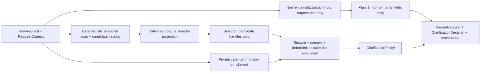
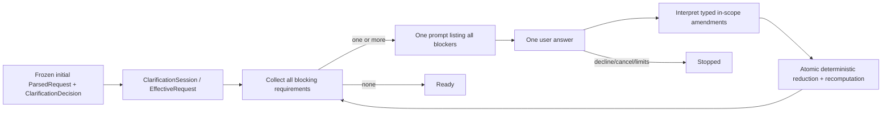

# Architecture Overview

## Eventual workflow

`Raw request -> Parse request -> Clarify constraints -> Plan searches -> Run provider tools -> Normalize and validate -> Rank candidates -> Explain recommendations`

## Current request-understanding boundary

The current slice stops after request interpretation and clarification selection. It uses strict
non-temporal Pass 1 plus a date-free opaque temporal selector. Deterministic code scans temporal
wording, builds and validates candidate catalogs, resolves holiday anchors, restores only selected
local candidates, compiles the canonical relation graph, evaluates calendar windows, and applies
conflict and clarification policy. Sequential model-authored temporal resolution is retired by ADR
0010.

The initial-turn boundary is complete and frozen. Luna is the configured model for both model boundaries in
the qualified implementation: non-temporal Pass 1 and the opaque temporal selector. Sequential
two-pass resolution is retired from the live code path. The final qualification record is the
three-trial selector-only run with 47/48 passes (97.92%), zero errors, and one documented
clarification miss. On 2026-09-08, the project owner approved the additive iterative
clarification-session boundary in ADR 0011. It accepts answers to a prompt that lists all current
blockers, applies any valid subset with turn-level provenance, and recomputes the remaining
blockers until the session is `ready` or `stopped`. The initial-turn behavior remains frozen.

## Responsibility table

| Responsibility | Current owner | Reason |
| --- | --- | --- |
| Coarse semantic extraction | first model pass | Natural-language interpretation is the core semantic task. |
| Ambiguity identification | model | Ambiguity detection depends on language understanding and uncertainty recognition. |
| Explicit airport-code preservation | deterministic code | A model-classified verbatim IATA code is already a stable downstream identifier. |
| Holiday calendar dates | `HolidayDateProvider` | Nager.Holidays API v4 supplies U.S. federal-holiday anchors. |
| Temporal candidate selection | selector model | It may select only deterministic, opaque local candidates, including explicit unresolved choices. |
| Temporal relation construction | deterministic compiler | Candidate relations, targets, references, and composition are pre-authored and validated before compilation. |
| Calendar evaluation | deterministic code | Holiday windows, weekends, weekdays, offsets, month portions, durations, and final ranges must be reproducible. |
| Dependency/reference validation | deterministic code | Anchor existence, request-field ordering, and cycles are exact graph invariants. |
| Schema validation | deterministic code | Contract enforcement should not depend on model behavior. |
| Evidence span resolution | deterministic code | Quotes must match the immutable request exactly; offsets and ambiguity handling must be reproducible. |
| Evidence, anchor, and symbolic-reference catalogs | deterministic code | Stable IDs and allowed membership form the trust boundary between model passes. |
| Claim/evidence sufficiency evaluation | deterministic code | Allowed envelopes and required fragments are fixture-defined correctness rules. |
| Conflict detection | deterministic code | Contradiction checks need explicit, auditable rules. |
| Initial clarification selection | deterministic policy | The frozen initial turn returns one legacy prioritized decision; the session converts active blockers into one all-blockers message. |
| Clarification-session reduction | deterministic code | It collects every active blocker, applies typed in-scope amendments and supported explicit corrections, and atomically recomputes effective state. |
| Clarification-answer interpretation | narrow model boundary | It may propose typed amendments for current blockers or an explicit supported correction; it cannot invent arbitrary constraints. |
| Point balances and spending budgets | deferred | Excluded from MVP extraction, parsed output, and clarification policy. |
| Search planning | deferred | Outside the current milestone. |
| Travel-provider calls | deferred | Outside the current milestone. |
| Ranking | deferred | Outside the current milestone. |
| Final explanation | deferred | Outside the current milestone. |

## Current request-understanding diagram

The `RawRequest` context remains inside deterministic orchestration. Neither model boundary sees a
concrete reference date, timezone, resolved anchor boundary, holiday-provider metadata, or inferred
calendar value. The selector sees only supplied local evidence, anchors, candidates, and production
handles. `next month` remains a symbolic whole-calendar-period relation until deterministic
evaluation; `next spring` remains unresolved because no deterministic season policy is approved.

The holiday lookup is only exercised for holiday anchors. Exact-date and month anchors do not call
Nager.Holidays. API failures and invalid responses surface as explicit errors; there is no
hand-coded success fallback. Unit tests inject fake model passes and a fake provider and do not
require network access.

The retained `DateResolutionProposal` in `ParsedRequest` is generated after deterministic graph
evaluation for trace and historical scorer compatibility. The authoritative internal semantic
contract is `TemporalRelationGraph`; no model response authors it.

This diagram describes the completed initial-turn request-understanding slice. The live workflow
currently stops at `ClarificationDecision`. ADR 0011 adds an implementation-stage continuation
boundary between an `ask` decision and later search planning.

## Iterative clarification-session boundary

The session stores immutable revisions and answer-turn provenance. A prompt has exact coverage of
the current blocker set; an answer may resolve any subset and may explicitly correct a supported
already-resolved field. The local experimental Streamlit
harness may call this boundary through an application controller but contains no parsing, policy,
merge, provider, or persistence logic. LangChain and LangGraph are not part of this stage.
The answer-interpreter model boundary receives only answer identity/text and active typed blockers;
the original `RequestContext`, effective state, and ledger remain deterministic-only.
The detailed implementation sequence and acceptance gates are in
`docs/handoffs/2026-09-08-clarification-continuation-implementation-plan.md`.
