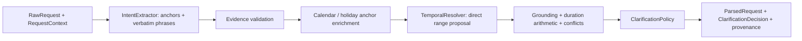

# Architecture Overview

## Eventual workflow

`Raw request -> Parse request -> Clarify constraints -> Plan searches -> Run provider tools -> Normalize and validate -> Rank candidates -> Explain recommendations`

## Current request-understanding boundary

The current slice stops after request interpretation and clarification selection. It may use
two model passes, and it uses Nager.Holidays as the source for U.S. federal-holiday calendar dates.
The first pass extracts coarse anchors and verbatim temporal wording; the second proposes direct
date ranges after anchor enrichment. Deterministic code remains responsible for grounding,
explicit-anchor resolution, duration arithmetic, conflict checks, and clarification policy.

## Responsibility table

| Responsibility | Current owner | Reason |
| --- | --- | --- |
| Coarse semantic extraction | first model pass | Natural-language interpretation is the core semantic task. |
| Ambiguity identification | model | Ambiguity detection depends on language understanding and uncertainty recognition. |
| Holiday calendar dates | `HolidayDateProvider` | Nager.Holidays API v4 supplies U.S. federal-holiday anchors. |
| Temporal range proposal | second model pass | Normal modifiers remain natural language until grounded anchors are available. |
| Duration arithmetic | deterministic code | Exact return bounds must be reproducible from interpreted duration bounds. |
| Schema validation | deterministic code | Contract enforcement should not depend on model behavior. |
| Conflict detection | deterministic code | Contradiction checks need explicit, auditable rules. |
| Clarification selection | deterministic policy | Asking at most one focused question should follow stable policy. |
| Point balances and spending budgets | deferred | Excluded from MVP extraction, parsed output, and clarification policy. |
| Search planning | deferred | Outside the current milestone. |
| Travel-provider calls | deferred | Outside the current milestone. |
| Ranking | deferred | Outside the current milestone. |
| Final explanation | deferred | Outside the current milestone. |

## Provisional current-slice diagram

The holiday lookup is only exercised for holiday anchors. Exact-date and month anchors do not call
Nager.Holidays. API failures and invalid responses surface as explicit errors; there is no
hand-coded success fallback. Unit tests inject fake model passes and a fake provider and do not
require network access.

This diagram is provisional and only describes the current request-understanding slice.
