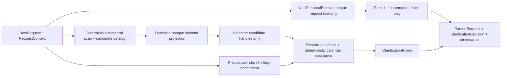
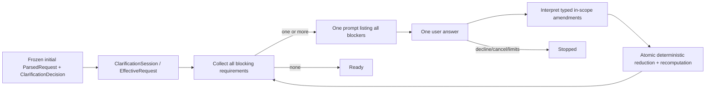

# Architecture Overview

## Eventual workflow

`Raw request -> Parse request -> Clarify constraints -> Plan searches -> Run provider tools -> Normalize and validate -> Rank candidates -> Explain recommendations`

## Current request-understanding boundary

The current slice stops after request interpretation and clarification selection. Under ADR 0017,
one semantic receiver reads the complete raw request and emits groundable facts plus generic
calendar operations. Deterministic code never reparses wording: it validates exact quotes, computes
calendar results against immutable context, applies conflicts and one-way/cash policy, and derives
clarification. The legacy scanner, candidate catalog, and selector are historical only; there is no
live fallback or strategy switch.

ADR 0016 remains the one-way award-only policy. On 2026-09-08, the project owner approved the additive iterative
clarification-session boundary in ADR 0011. It accepts answers to a prompt that lists all current
blockers, applies any valid subset with turn-level provenance, and recomputes the remaining
blockers until the session is `ready` or `stopped`. The initial-turn behavior remains frozen.
That frozen initial parser still does not recognize a bare `this weekend`; support for that phrase
and the related `this`/`on` weekday forms is scoped to clarification answers only.

## Responsibility table

| Responsibility | Current owner | Reason |
| --- | --- | --- |
| Initial semantic extraction | semantic receiver | Natural-language interpretation, including typos and reasonable date paraphrases, is the core semantic task. |
| Ambiguity identification | model | Ambiguity detection depends on language understanding and uncertainty recognition. |
| Explicit airport-code preservation | deterministic code | A model-classified verbatim IATA code is already a stable downstream identifier. |
| Holiday calendar dates | `HolidayDateProvider` | Nager.Holidays API v4 supplies U.S. federal-holiday anchors. |
| Temporal operation proposal | semantic receiver | It proposes grounded reusable calendar operations, never resolved dates. |
| Calendar compilation | deterministic compiler | It validates and evaluates generic operations using immutable context and providers. |
| Calendar evaluation | deterministic code | Outbound holiday windows, weekends, weekdays, offsets, month portions, and final ranges must be reproducible. Return/duration semantics are explicitly unsupported in the active workflow. |
| Dependency/reference validation | deterministic code | Anchor existence, request-field ordering, and cycles are exact graph invariants. |
| Schema validation | deterministic code | Contract enforcement should not depend on model behavior. |
| Evidence span resolution | deterministic code | Quotes must match the immutable request exactly; offsets and ambiguity handling must be reproducible. |
| Evidence, anchor, and symbolic-reference catalogs | deterministic code | Stable IDs and allowed membership form the trust boundary between model passes. |
| Claim/evidence sufficiency evaluation | deterministic code | Allowed envelopes and required fragments are fixture-defined correctness rules. |
| Conflict detection | deterministic code | Contradiction checks need explicit, auditable rules. |
| Initial clarification selection | deterministic policy | The frozen initial turn returns one legacy prioritized decision; the session converts active blockers into one all-blockers message. |
| Clarification-session reduction | deterministic code | It collects every active blocker, applies typed in-scope amendments and supported explicit corrections, and atomically recomputes effective state. |
| Clarification-answer interpretation | narrow model boundary | It may propose typed amendments for current blockers or an explicit supported correction; it cannot invent arbitrary constraints. |
| Point balances and spending budgets | deferred | Excluded from MVP extraction, parsed output, and clarification policy. |
| Search planning (Milestones 1, 2A, 2B, and 2C) | stage complete; owner-closed and owner-qualified 2026-09-21; planning-only | It deterministically compiles a frozen `EffectiveRequest`, official endpoint source, and replay-bound 2B record into a provider-neutral `CompiledSearchPlan`. Every replay-valid representable relationship compiles with semantic query deduplication and exact provenance. Its identity binds request, endpoint, catalog, replay, market-policy, compiler, and planning-policy evidence; provider capability is owned downstream. The only compiler limit is the all-or-nothing 100-pair structural cross-product guard. It has no provider calls, response parsing, ranking, or mutation of upstream state. |
| Geographic and airport-data foundation (Milestone 1) | complete; owner-qualified 2026-09-21 | The owner monitored and reviewed the local SQLite release for its declared catalog/serving boundary. It serves GeoNames and OurAirports identity, taxonomy, provenance, and bounded lookup data through the repository boundary; it does not claim airport-serving or route coverage. |
| Endpoint-airport selection (Milestone 2A) | implemented; owner-adopted and owner-qualified 2026-09-21 | Explicit and uniquely resolved named airports remain direct catalog singletons. Exactly resolved geographic entities use the bounded model proposal, deterministic catalog/policy validation, immutable selection record, and M2C replay. The official selector retains model-proposed provenance rather than becoming catalog fact. Independent external or holdout corroboration is not claimed and may inform future policy revision. |
| Gateway-airport discovery (Milestone 2B) | implemented; owner-qualified 2026-09-21 | An approved versioned market policy skips only fully known single-market inputs; all other valid inputs receive one grouped structured model proposal. Catalog and relationship validation produces bounded unverified search hypotheses and an immutable replay record. Access gateways may be materially complementary alternatives for already-strong endpoints only when they add specific incremental value; size, proximity, shared market, or diversity alone is insufficient. The independent maxima are 2 origin access, 2 destination access, and 5 hubs (9 total), with no hub-market diversity quota. Prompt-v5/casebook-v2 and the first prompt-v5/casebook-v3 runs are historical diagnostics; prompt-v6/casebook-v3 completed 42/42 calls across two trials, with 82 candidates, 43 scopes, and 400 accepted relationships. The owner monitored, reviewed, and qualified the boundary for its declared scope. Mapping gaps force generation, while model/policy market disagreements remain advisory to 2C; neither establishes a route, schedule, feasible connection, award seat, or bookable itinerary. |
| Travel-provider calls | subsequent separate stage | Provider execution consumes a stale-checked plan only after the declared operational knowledge coverage is available; no adapter or provider call is part of the planner qualification or the active gateway-discovery cut. |
| Ranking | deferred | Outside the current milestone. |
| Final explanation | deferred | Outside the current milestone. |

## Current request-understanding diagram

The `RawRequest` context remains inside deterministic orchestration. Neither model boundary sees a
concrete reference date, timezone, resolved anchor boundary, holiday-provider metadata, or inferred
calendar value. The selector sees only supplied local evidence, anchors, candidates, and production
handles. `next month` remains a symbolic whole-calendar-period relation until deterministic
evaluation; `next spring` remains unresolved because no deterministic season policy is approved.

The holiday lookup is only exercised for holiday anchors. Exact-date and month anchors do not call
Nager.Holidays. API failures and invalid responses surface as explicit errors; there is no
hand-coded success fallback. Unit tests inject fake model passes and a fake provider and do not
require network access.

The retained `DateResolutionProposal` in `ParsedRequest` is generated after deterministic graph
evaluation for trace and historical scorer compatibility. The authoritative internal semantic
contract is `TemporalRelationGraph`; no model response authors it.

This diagram describes the completed initial-turn request-understanding slice. The live workflow
currently stops at `ClarificationDecision`. ADR 0011 adds an implementation-stage continuation
boundary between an `ask` decision and later search planning.

## Iterative clarification-session boundary

The session stores immutable revisions and answer-turn provenance. A prompt has exact coverage of
the current blocker set; an answer may resolve any subset and may explicitly correct a supported
already-resolved field. The local experimental Streamlit
harness may call this boundary through an application controller but contains no parsing, policy,
merge, provider, or persistence logic. LangChain and LangGraph are not part of this stage.
The answer-interpreter model boundary receives only answer identity/text and active typed blockers;
the original `RequestContext`, effective state, and ledger remain deterministic-only. The
clarification-specific temporal normalizer resolves `this weekend`, `this <weekday>`, and
`on <weekday>` from the retained context. A complete numbered answer line maps one-based to the
ordered typed prompt requirements; the mapping is not inferred from incidental numbers in prose.
When the model returns a narrow temporal fact span, deterministic endpoint-cue repair is bounded
to that same answer message and the fact's same physical sentence or answer line. It accepts a
single local fact, or exactly two local facts joined by one `and`/`then`, only when the cue agrees
with the typed target; alternatives/disjunctions, cross-line or cross-sentence facts, distant cues,
multiple uncoordinated facts, and target mismatches are explicitly ambiguous and re-asked. The
narrow span remains the provenance source even when local cue context is used for validation.
For continuation-only relative expressions not handled by that legacy normalizer, the model sees
one static, date-free catalog of opaque temporal affordances and grounds answer-local spans plus
weekday slots. It receives no reference date, session state, fixture key, candidate, or internal
template ID. Deterministic code validates complete selection/unresolved provenance, blocker
ownership, same-answer departure dependencies, and calendar arithmetic. The selector is global
rather than a regex-harvested per-answer candidate list; the frozen initial path is unchanged.
The detailed implementation sequence and acceptance gates are in
`docs/handoffs/2026-09-08-clarification-continuation-implementation-plan.md`.

## Approved accepting-clarification refinement

[ADR 0012](adr/0012-accepting-clarification-and-behavioral-evaluation.md) defines the next
continuation cut without changing the frozen initial workflow. It refines the session boundary so
that a reasonable, grounded fuzzy answer may become one bounded, visible approximation instead of
being rejected for narrow grammar mismatch. Deterministic code still owns span grounding, symbolic
meaning validation, date arithmetic, state reduction, and all blocker policy; discrete choices,
conflicts, and unresolved endpoint ownership remain targeted clarification cases.

ADR 0013 removes the separate prompt-writing runtime boundary. The answer receiver may return
ordered follow-up items in the same call that interprets an answer. The controller renders them
only after deterministic reduction when their IDs exactly equal the authoritative remaining
blockers; a mismatch uses the issue-specific deterministic fallback. Evaluation correspondingly keeps exact safety
invariants as gates while assessing conversational behavior through property-based acceptable
actions, false-blocking and incorrect-assumption rates, paraphrase robustness, and
human-calibrated review rather than one golden fuzzy interpretation.

The implementation is qualified by the redacted three-trial Luna behavioral artifact at
`evals/clarification/baseline/2026-09-10-gpt-5.6-luna-behavior-v2-final.json`: 129/129 calls were
privately captured, with zero model/system/evaluator errors, zero false blocks, and zero incorrect
acceptances. Its conflict follow-ups remained safe but were generically worded in three trials;
this is a recorded presentation-quality finding, not a state-safety exception.
