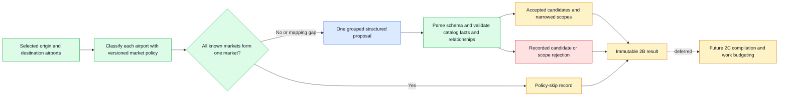

# Stage Takeaways: Milestone 2B market-aware gateway-airport discovery

## 1. Stage Context

Milestone 2B turns already selected origin and destination airport sets into a policy skip or a
bounded, inspectable set of optional gateway-search hypotheses. Its boundary is:

```text
selected endpoint airports
  -> deterministic planning-market gate
  -> one grouped model proposal when required
  -> deterministic catalog and relationship validation
  -> immutable candidate-selection result
```

The stage ends before search-strategy compilation, provider payloads or calls, itinerary assembly,
availability, and bookability. The owner closed 2B on 2026-09-19 and deferred opening Milestone 2C.
Closure accepts the implemented boundary and its evidence record; it does not claim independent
human semantic qualification, verified connectivity, or adoption of the diagnostic-only Milestone
2A selector.

## 2. Final Design Explanation

The model proposes optional airports and explicit applicability. Deterministic code owns the
planning-market classification and gate, catalog identity, facility eligibility, references,
scope integrity, pool caps, dependency pruning, issue records, and replay identity. Blue nodes in
the diagram are model-owned work, green nodes are deterministic work, amber nodes are durable
outputs, and red nodes are explicit non-mutating rejection paths.



The gate skips generation only when both endpoint sets are nonempty, every original endpoint has
a known market, and the union of all endpoint markets has exactly one member. A mapping gap invokes
the model with explicit unknown context. A model/policy candidate-market mismatch is retained as an
advisory rather than used as a semantic rejection.

The grouped response has three independent pools: at most two origin-access alternatives, two
destination-access alternatives, and five intermediate hubs. These are ceilings, not targets.
Major endpoints may still receive a complementary access alternative, but airport size, proximity,
shared market, or geographic diversity alone is not sufficient. Prompt v6 asks the model to
reconcile uncertainty with each pairing and to consolidate candidates with the same function and
scope. Accepted candidates remain unverified search hypotheses.

## 3. Starting Point and Design Evolution

- **Market-policy and grouped-proposal boundary.** ADR 0020 replaced the opening requirement for
  independent connectivity evidence with bounded model-originated hypotheses plus deterministic
  validation. The market overlay remains separate from physical catalog geography.
- **Access alternatives and independent caps.** Review of the West Coast-to-Paris diagnostic led
  to allowing useful destination- or origin-access alternatives even for strong endpoints and to
  a fixed `2 + 2 + 5` candidate envelope. Search-work reduction remained a downstream concern.
- **Wider casebook exposed relationship multiplication.** Casebook v3 added 15 grounded scenarios.
  Prompt v5 accepted 125 candidates whose scopes expanded to 731 relationships, showing that a
  candidate count is not a search-work budget.
- **Relationship-aware prompt refinement (final).** Prompt v6 added per-pair uncertainty/scope
  reconciliation and same-scope consolidation without changing the response schema, adapter,
  market policy, catalog, or validator. It reduced accepted candidates to 82 and relationships to
  400. The owner closed the stage with the remaining limitations disclosed rather than adding a
  case-specific prompt v7 or an unsupported deterministic geography rule.

## 4. Key Learnings

### Learning: Candidate caps do not bound downstream search work

**Observation.** The first v3 run stayed within every candidate-pool cap but expanded 125 accepted
candidates into 731 relationships. Wide grouped endpoint sets produced the largest multipliers.

**Evidence.** Prompt-v5/casebook-v3 artifact and semantic review in the 2B build log.

**Change made.** Prompt v6 required pair-specific scope reconciliation and consolidation. Accepted
relationships fell to 400, a 45.3% reduction, without an important omission observed in the AI
review.

**Generalized takeaway.** Bound the unit that drives cost. Candidate count is an inspection bound;
compiled relationships or provider search items are the work bound.

**Carry-forward.** Milestone 2C must preserve mandatory endpoint coverage and apply deterministic,
priority-preserving budgets to compiled relationships/search items.

### Learning: Uncertainty should narrow applicability, not become hidden confidence

**Observation.** Some model reasons honestly described a pairing as marginal or circuitous while
the scope still included it. Prompt v6 improved but did not eliminate that behavior; residual wide
results and an IPC-to-PPT regression remain recorded.

**Generalized takeaway.** Model uncertainty is useful provenance, but it is not deterministic proof
of usefulness or infeasibility. Preserve it, ask the model to act on it, and keep downstream work
bounded rather than inventing route facts.

### Learning: Partial acceptance and abstention are valid outcomes

**Observation.** Same-market requests skipped without a call, several generated cases returned an
empty result, and one v6 result safely rejected PNH because it was absent from the pinned catalog.
The accepted remainder and all issues stayed inspectable.

**Generalized takeaway.** Optional generation should fail soft without weakening mandatory endpoint
coverage. Missing catalog identity means “not validated in this snapshot,” not “airport does not
exist.”

### Learning: Broader grouped fixtures reveal behavior that pairwise examples hide

**Observation.** The eight-case book supported prompt and contract debugging, but the 23-case v3
book exposed scope multiplication, trial variation, and role-quality weaknesses in large endpoint
sets.

**Generalized takeaway.** Evaluation should include both focused boundary cases and grouped stress
cases, while keeping exact candidate lists out of the oracle.

## 5. Cross-Cutting Synthesis

The largest design shift was from treating “a few candidates” as inherently bounded to separating
candidate inspection bounds from downstream search-work bounds. The final 2B contract is therefore
deliberately permissive about unverified hypotheses but strict about identity, references,
provenance, replay, and visible rejection. That division lets 2C make deterministic work-budget
decisions later without rewriting 2B candidates as verified routes or invalid airports.

## 6. Open Questions

- What relationship/search-item budget and priority order should 2C apply while preserving every
  mandatory original endpoint pairing?
- How should 2C deduplicate semantically equivalent supplemental searches without erasing candidate
  provenance or advisory market mismatches?
- If model reasons become user-visible, what general text-sanitization contract should apply to the
  control-character issue observed in one private trace?
- What adoption decision, if any, will later be made for the separate diagnostic-only 2A endpoint
  selector?

## 7. Implications for the Next Stage

Milestone 2B is closed until explicitly reopened. A future 2C may rely on the immutable 2B result,
accepted/rejected scope decisions, issue and advisory records, catalog and policy identities, and
the fixed candidate priority order. It must preserve mandatory endpoint coverage, budget actual
compiled work, record omissions without calling accepted candidates invalid, and retain the
unverified-connectivity disclosure. Opening 2C is a separate owner decision.

## Appendix: Evidence Index

| Topic | Current design / decision | Evaluation / tests |
| --- | --- | --- |
| Architecture and boundary | `docs/adr/0020-market-aware-model-proposed-gateway-candidates.md` | `tests/unit/test_gateway_discovery.py` |
| Generator and grouped contract | `src/award_agent/search_planning/gateway_generator.py` | `tests/unit/test_gateway_generator.py` |
| Market gate and validation | `src/award_agent/search_planning/gateway_discovery.py` | `tests/unit/test_market_policy.py` |
| Evaluation protocol | `docs/evaluation/gateway-discovery-evaluation-protocol.md` | `tests/unit/test_gateway_discovery_live_eval.py` |
| Final v6 evidence | `evals/gateway_discovery/baseline/2026-09-19-gpt-5.6-luna-prompt-v6-casebook-v3-2-trials.json` | 46 records, 42/42 calls, 400 accepted relationships |
| Build evidence | `docs/build-log/2026-09-17-m2b-gateway-airport-discovery-opened.md` | Commits `71eeaf3`, `eaf9a64` |
