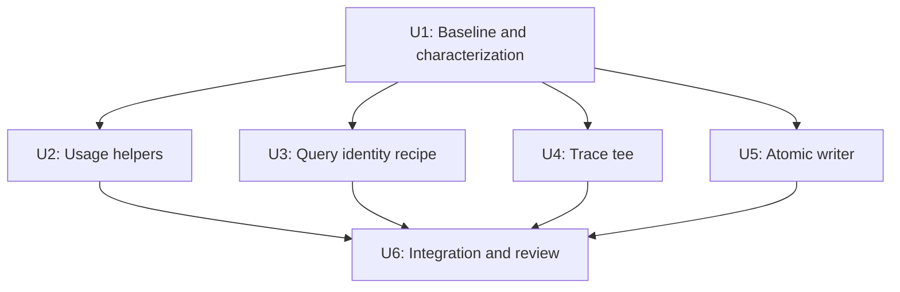

# Behavior-Preserving Cleanup - Plan

**Execution disposition (2026-10-04):** The owner subsequently authorized implementation. U2, U4, and U5 were implemented. Fresh implementation review rejected the U3 callback-based extraction as more complex than the two explicit recipes when preserving their different error behavior; the original identity source was restored and the new literal-identity tests retained. See the [implementation build log](../build-log/2026-10-04-behavior-preserving-cleanup.md) for verification and measured scope. The original plan below remains the record of the reviewed proposal.

## Goal Capsule

**Objective:** Make repeated maintenance changes easier while keeping the current award-search workflow and its evidence outputs unchanged.

**Means:** Extract four small pieces of duplicated logic, narrowed by the six-cut verification below (KTD1–KTD4).

**Authority:** The owner's request for unchanged current behavior, `AGENTS.md`, `docs/project-state.md`, relevant ADRs, then this plan. This is a plan for later implementation; it authorizes no implementation, commit, or publication in the planning session.

**Execution:** Offline characterization first. The parent integrates independent work and owns acceptance. Any mismatch in a protected behavior stops that unit for diagnosis; it is not permission to change expected outputs or broaden scope.

---

## Product Contract

### Summary

Proceed with narrowed audit cuts 2, 4, 5, and 6. Retain cuts 1 and 3 because deletion removes currently importable APIs, and cut 1 also removes a historical source-evidence verifier. Treat the original 440-line estimate as withdrawn; preservation and lower maintenance cost are the acceptance criteria.

### Problem Frame

The audit identified repeated usage accounting, query identity construction, trace forwarding, and atomic file writing. A second source review found differences hidden inside apparent duplication. Consolidating those differences would change failure behavior or replay identity. Local development status permits an intentional retirement, but does not make removal behavior-preserving.

### Requirements

**Observable behavior**

- R1. Preserve current supported imports, CLI arguments, return/exit outcomes, model-call counts, workflow policies, and serialized outputs.
- R2. Preserve usage parsing, token totals, missing-call accounting, drain/reset timing, trace order and identity, and existing exception propagation in the affected paths.
- R3. Preserve query IDs, canonical hash bytes, provenance exclusions, validation rejection, and all saved planning/provider/ranking evidence.
- R4. Preserve atomic new-file publication, exact text/newline behavior, refusal to overwrite, and current failure/cleanup behavior.

**Scope and proof**

- R5. Implement only the narrowed extractions below; retain the historical modules and aliases identified by cuts 1 and 3.
- R6. Establish baseline characterization before editing, require independent expected values, and verify offline without model or travel-provider calls.
- R7. Record actual changes, tests, failures, and final measured diff in a build log; do not turn static review into a claim of runtime equivalence or stage qualification.

### Six-cut verification

Each row was investigated by a separate agent against source and references at repository HEAD `9ae2616`. No runtime tests were executed for this planning review. Verdicts establish a proposed safe boundary, not a completed equivalence proof.

| Audit cut | Disposition | Source-backed reason | Implementation scope |
| --- | --- | --- | --- |
| 1. Cached Search capability removal | Retain | Active M2C does not consume it, but `search_planning/__init__.py:43` still exports the API; `capabilities.py:117` validates historical source paths and hashes. Removing its test does not prove equivalent behavior. | No changes to `capabilities.py`, its receipt classes/exports, old JSON, or the capability-source test. |
| 2. Usage accounting | Narrow and proceed | Clarification guards missing `model_dump`; airport/gateway invoke it directly. Both groups share token-field checks and aggregation. | Share only payload-to-record conversion and aggregate arithmetic; keep extraction and state in each adapter. |
| 3. Evaluator aliases | Retain | Three modules intentionally re-export four canonical names each. No internal caller was found, but deletion removes existing import paths. | Keep `clarification_continuation.py`, `clarification_behavior.py`, and `clarification_semantic_guardrails.py`. |
| 4. Query identity/digest duplication | Narrow and proceed | Construction consumes a prevalidation dict; validation consumes a model. The general serializers differ on non-Enum objects with `.value`. | Share only the query-identity field recipe; keep the general digest and normalization functions separate and unchanged. |
| 5. Gateway trace tees | Proceed with characterization | All three forward two methods and extend a sink before returning the original trace collection. Factories and capture handling live elsewhere. | Share forwarding behavior only; retain evaluator factory/budget/reconciliation logic. |
| 6. Atomic output writers | Proceed with body-preserving extraction | Writer bodies match except for a docstring. Existing CLI guards and input rechecks are outside the helpers. | Move the exact writer body to a private CLI helper; preserve existing local callable names. |

### Scope Boundaries

No prompt, model, SDK request, repair, date, selection, matching, ranking, provider, or Results behavior changes. No dependency or policy-version changes. No broad formatting pass, new generic adapter base class, telemetry lifecycle, serialization framework, or file-publication framework.

Historical retirement remains under the existing D12 entry in `DEFERRED.md`; this plan neither opens nor closes it. The earlier selector implementations and gfly diagnostic remain evidence. Unexpected defects found during implementation are recorded separately, not silently fixed inside a refactor.

Private implementation class identities and storage names are not new supported interfaces. Preserve existing module-level private callable names where an import alias does so cheaply; do not add speculative compatibility frameworks. Actual in-repository references and monkeypatch targets must still be checked before moving a helper.

---

## Planning Contract

### Key Technical Decisions

- KTD1. **Pure usage helpers, adapter-owned state.** Add `src/award_agent/observability/usage.py` for token validation from an already extracted payload and aggregate arithmetic. Keep the SDK-object extraction, counters, reset methods, `None` guards, and capture call positions in the four adapters. This preserves R2 without a configurable collector.
- KTD2. **Share the identity recipe only.** Place a small common logical-query payload builder in `search_planning/compilation_contracts.py`, which the planner already imports. Retain caller-specific dict/model adaptation where necessary. Do not change `_digest`, `_canonical_digest`, or either `_canonical_json_value`; do not import the planner from contracts. Literal prechange expectations protect R3 when producer and validator share a recipe.
- KTD3. **One private evaluation tee.** Add `evaluation/_gateway_trace_tee.py` and import its implementation under the existing `_TraceTee` / `_GatewayTraceTee` names. The helper owns only the three forwarding methods and the two referenced objects. It performs no copying, normalization, error recovery, or redaction.
- KTD4. **One private CLI writer.** Add `cli/_atomic_output.py` and import `write_new_atomic as _write_new_atomic` in both ranking CLIs. Move the current body verbatim, including cleanup behavior. Retain caller guards and input rechecks.
- KTD5. **Characterization is the execution gate.** Source review cannot prove a future patch equivalent. Run baseline tests and add missing behavioral cases before moving logic. Preserve independent literal expected results rather than deriving expectations with the extracted helper.

### Dependency Shape

Usage and trace work are separate owners even though both concern telemetry. Do not edit shared package exports or each other's tests concurrently. The parent coordinates any ownership change and runs aggregate verification after all edits land.

### Evidence Boundaries

The repo currently records existing broad-check issues under G05. Those historical counts are not a fresh baseline. Establish current failures at implementation time and compare like-for-like; a prior failure may be disclosed, but a new failure in a touched path must be resolved. A blocked replay gate is not a passing gate.

---

## Implementation Units

### U1. Establish the unchanged-behavior baseline

**Goal:** Make regressions distinguishable from pre-existing failures. **Requirements:** R1–R7. **Dependencies:** None.

**Files:** Existing tests named in the Verification Contract; new characterization tests listed in U2–U5; a dated entry under `docs/build-log/`.

**Approach:** Record HEAD, working-tree changes, Python/tool versions, focused test results, broad-check failures, and hashes of saved evidence. Capture literal expected query IDs and serialized plan results before changing source. Keep baseline captures outside tracked evidence directories unless a small reviewed regression fixture is needed. Do not regenerate stored evidence to make a check pass.

**Execution note:** Characterize the existing functions first; move one unit at a time after its baseline is understood.

**Verification:** Relevant focused tests either pass or have individually diagnosed pre-existing failures. All planned byte-comparison inputs are available locally. Record missing ignored catalog inputs as a specific gate limitation, not a reason to weaken the expected result.

### U2. Extract common usage arithmetic (audit cut 2)

**Goal:** Maintain one copy of token validation and aggregation. **Requirements:** R1, R2, R5–R7. **Dependencies:** U1.

**Files:** New `src/award_agent/observability/usage.py`; `clarification/openai_interpreter.py`, `clarification/openai_composer.py`, `search_planning/airport_selector.py`, `search_planning/gateway_generator.py`; `tests/unit/test_usage_accounting.py` and their four existing adapter test files.

**Approach:** Implement KTD1 with two pure functions: a token-record function returning a three-key record or `None`, and an aggregation function returning the existing six-key result. Keep payload extraction in each adapter, then append the returned record exactly where the current method appends. Aggregation does not reset anything or decide when to return `None`. Exclude both `intent/openai_interpreter.py` and `intent/openai_extractor.py`, whose counting/empty-usage behavior differs.

**Test scenarios:**

- Dictionary and SDK-object usage produce the existing input/output/total token record and six-key aggregate.
- Missing/noninteger input or output is ignored; missing/noninteger total falls back to their sum. Preserve current `isinstance(int)` handling, including booleans and negative values, without new validation.
- A usage object lacking callable `model_dump` is ignored by clarification but preserves the current planning failure. Dump failures and nonmapping results propagate as before.
- Zero calls returns `None`; attempted calls without captured usage return the existing zero-token aggregate. Failed SDK calls remain attempts; serialization failures before increment do not become attempts.
- Multiple calls, repeated `take_usage`, `reset_usage`, and `reset_capture` retain their separate lifecycle behavior. Wrong parsed output preserves existing capture timing.

**Verification:** Test through each adapter with fake clients as well as the pure helpers. The clarification-interpreter test currently lacks nonempty usage assertions; add those before extraction. No request arguments, trace sequence, or reset ordering changes.

### U3. Consolidate the query-identity field recipe (audit cut 4)

**Goal:** Keep semantic identity fields in one place without broadening digest behavior. **Requirements:** R1, R3, R5–R7. **Dependencies:** U1.

**Files:** `src/award_agent/search_planning/planner.py`, `compilation_contracts.py`; `tests/unit/test_search_strategy_compiler.py`, `test_search_planning_compilation_contracts.py`, and a focused `test_query_identity.py` if needed for readable parameterized cases.

**Approach:** Apply KTD2 to `planner.py:997` and `compilation_contracts.py:1573`. Preserve the current prevalidation dict path and model-validation path. The common recipe retains `logical-award-query-semantics-v1`; the five envelope fields `start`, `end`, `inclusive`, `basis`, `timezone`; cabin order; and all obligation fields except `field_provenance`. `effective_window_precision` and envelope provenance remain excluded. Preserve raw field lookup/error behavior in small input adapters rather than making either path more permissive. Keep the old private entry points available as thin wrappers if an import alias cannot preserve input behavior.

**Test scenarios:**

- The same real typed query passed through the construction dict and model paths yields the pinned prechange query ID and canonical bytes.
- Changes to omitted provenance or effective-window precision retain the query ID; changes to semantic route/date/cabin/obligation fields change it.
- Missing required dict fields and malformed obligation input retain the existing exception behavior; the model path still requires its current typed objects.
- The synthetic offline golden corpus reproduces prechange complete result digests; saved plans retain query IDs, plan digests, and serialization.
- Forged query identity and independently rehashed semantic tampering are still rejected by the contract. Expected values must not call the shared recipe.

**Verification:** Preserve both normalization implementations and all general digest callers. Require prechange literal expectations and the existing four-case planning golden gate; producer/validator agreement alone is insufficient.

### U4. Extract gateway trace forwarding (audit cut 5)

**Goal:** Maintain one copy of tee behavior across three evaluators. **Requirements:** R1, R2, R5–R7. **Dependencies:** U1.

**Files:** New `src/award_agent/evaluation/_gateway_trace_tee.py`; `evaluation/gateway_discovery_live.py`, `search_planning_live.py`, `intent_to_search_planning_live.py`; new `tests/unit/test_gateway_trace_tee.py` and the three existing evaluator test files.

**Approach:** Apply KTD3. Leave each factory closure, per-case sink, construction marker, call-budget reservation, and core reconciliation unchanged. Constructor call sites currently use positional objects; keep that form. The core in `search_planning/gateway_discovery.py:1581` continues to drain traces before usage on success and failure.

**Test scenarios:**

- `propose` and `take_usage` delegate exactly once and return the same objects; exceptions propagate unchanged.
- `take_call_traces` appends to the existing sink in order and returns the original list with the original element references. Repeated drains do not fabricate or duplicate previously drained traces.
- A trace accessor failure leaves the sink untouched and produces the existing core capture issue; a proposal failure retains captured traces and attempted usage.
- Preserve current malformed-capture behavior: an iterable is extended before core validation, while a noniterable can fail inside the tee. Add no eager normalization or exception swallowing.
- Existing gateway and integrated-planning fake runs preserve receipts, redaction, call counts, and private traces. Add a bounded offline runtime case for intent-to-search-planning because its current test module covers preflight only.

**Verification:** Exercise all three caller integrations with fake adapters/repositories. Compare stable semantic/trace fields, excluding only explicitly variable run IDs, elapsed times, and temporary paths; do not normalize counts, ordering, receipts, or error codes.

### U5. Share the atomic ranking writer (audit cut 6)

**Goal:** Maintain one copy of immutable output publication. **Requirements:** R1, R4–R7. **Dependencies:** U1.

**Files:** New `src/award_agent/cli/_atomic_output.py`; `cli/ranking_match.py`, `cli/ranking_styles.py`; new `tests/unit/test_atomic_output.py`; `test_ranking_m1_cli.py`, `test_ranking_m2_cli.py`.

**Approach:** Apply KTD4. Preserve temporary-file creation beside the destination, its naming, UTF-8 text mode, one additional newline, file flush/fsync, hard-link publication, and `finally` cleanup. Do not substitute `Path.write_text`, rename/replace, a copy fallback, parent-directory fsync, or new exception handling. Preserve the fact that cleanup failure after a successful link can raise while the destination remains published.

**Test scenarios:**

- New nested output receives exact UTF-8 bytes and one additional newline, including when supplied text already ends with a newline.
- Existing file, existing symlink, dangling symlink, and a destination created after the CLI guard are not overwritten. Distinguish CLI `SystemExit(2)` from writer `FileExistsError` during a race.
- Inject failure in file fsync or hard-link publication: the original exception escapes and the temporary file is removed when cleanup succeeds.
- Inject cleanup failure after successful linking: preserve the published destination and propagated cleanup error.
- Both existing CLIs still produce identical JSON bytes, summaries, and input-recheck behavior.

**Verification:** Run shared-helper and both CLI suites on the current platform, then verify all three saved M1/M2 corpus cases. Do not claim new crash-durability guarantees.

### U6. Integrate, review, and record evidence

**Goal:** Accept the combined patch only when every protected behavior has evidence. **Requirements:** R1–R7. **Dependencies:** U2–U5.

**Files:** The combined diff and a dated `docs/build-log/` entry. Update current documentation only where extraction changes factual module references; preserve historical documents. Any proposed change to D12 must remain a separately labeled recommendation.

**Approach:** The parent integrates the units, runs aggregate gates, and commissions a fresh code review of the diff and characterization strength. Record actual line/dependency changes without a deletion quota. Remove abandoned implementation attempts. Do not suppress existing tests, remove assertions, update golden expectations, or discard historical evidence to obtain a green check.

**Verification:** All focused gates pass, saved evidence remains unchanged, and broad checks add no attributable failures. Report pre-existing broad failures and missing prerequisites by name. Any unresolved required gate prevents claiming this refactor behavior-preserving.

---

## Verification Contract

Commands below are for implementation, from the repository root. They were not executed while preparing this plan. New test paths become runnable in their owning units.

| Gate | Command / comparison | Acceptance |
| --- | --- | --- |
| Usage | `.venv/bin/python -m pytest -q tests/unit/test_usage_accounting.py tests/unit/test_clarification_openai_interpreter.py tests/unit/test_clarification_composer.py tests/unit/test_airport_selector.py tests/unit/test_gateway_generator.py` | Adapter-local edge behavior and shared arithmetic unchanged. |
| Identity | `.venv/bin/python -m pytest -q tests/unit/test_search_strategy_compiler.py tests/unit/test_search_planning_compilation_contracts.py tests/unit/test_search_planning_paths.py tests/unit/test_search_planning_evaluation.py` plus any new identity test module | Literal identities/bytes match and negative validation cases still fail. |
| Planning golden | `.venv/bin/python -m award_agent.cli.search_planning_eval` | Existing four cases and their complete result hashes pass unchanged. |
| Trace | `.venv/bin/python -m pytest -q tests/unit/test_gateway_trace_tee.py tests/unit/test_gateway_discovery_live_eval.py tests/unit/test_search_planning_live_eval.py tests/unit/test_intent_to_search_planning_live_eval.py` | Fake-runtime success, failures, counts, receipts, and trace semantics match. |
| Atomic output | `.venv/bin/python -m pytest -q tests/unit/test_atomic_output.py tests/unit/test_ranking_m1_cli.py tests/unit/test_ranking_m2_cli.py` | Exact bytes and immutable publication/failure semantics match. |
| Saved ranking | `.venv/bin/python -m pytest -q tests/unit/test_ranking_m1_corpus.py tests/unit/test_ranking_m2_corpus.py` | All three saved requests remain replayable without evidence changes. |
| Independent M2 replay | `PYTHONPATH=src .venv/bin/python scripts/ranking_style_corpus.py --fx-snapshot data/ranking/m2/fx-2026-09-29.json --output-dir evidence/ranking-stage/m2/styled --verify` | Existing byte, source-retention, and independent timing/style checks pass. |
| Aggregate | `.venv/bin/python -m pytest -q`; `.venv/bin/ruff check src tests`; `.venv/bin/mypy`; `git diff --check` | Required focused gates pass; broad failures are compared to the fresh baseline and no regression is introduced. |

Also check retained historical/alias imports, package import cycles, exact saved-file hashes, and changed-file scope. Preserve an immutable baseline of saved plans and literal query expectations before U3. Hash verification and semantic assertions serve different purposes; neither replaces the other.

---

## Definition of Done

- Cuts 1 and 3 remain intact, including their exports, fixtures, historical verification, and tests.
- U2–U5 each reduce a real duplicated responsibility without introducing configurable frameworks or changing their characterized behavior.
- Required focused and replay gates pass; independent expected values prevent a shared implementation from validating its own mistake.
- A fresh reviewer finds no unresolved behavior-preservation or evidence-integrity issue in the combined implementation.
- The final report names changed files, commands and results, measured diff, remaining baseline failures, and the limits of the evidence.
- No live calls, policy changes, upstream reopening, abandoned code, dependency changes, or saved-evidence rewrites are included.
