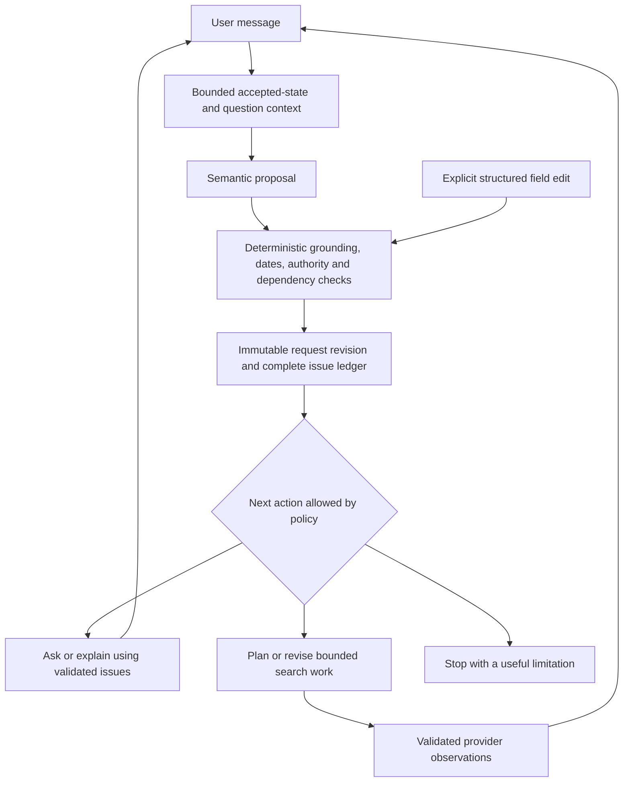

# Intent and clarification: improvement plan after the core workflow

Date: 2026-09-19. Status: **advisory plan requested by the owner; implementation remains deferred**.
Revised after a fresh Astra challenge and parent-agent debate; the [debate record](../build-log/2026-09-19-intent-clarification-improvement-plan.md#fresh-astra-challenge-and-parent-debate)
explains the changed priorities and remaining empirical questions.
The subsequent [use-case and FDE pass](../build-log/2026-09-19-intent-clarification-improvement-plan.md#real-use-case-and-fde-preparation-pass)
was challenged by a separate fresh Astra and grounds the plan in task value and personal learning.
Primary register entry: [D01 in DEFERRED.md](../../DEFERRED.md#parked-features-and-conditional-follow-ups).
Related gates: G01 conversational qualification, G03 constraint enforcement, G06 execution bounds,
and G07 evidence privacy. Related follow-ups: D04 trip-shaped input, D09 adaptive control, D12
historical-code retirement, and D14 user observation.

The owner wants to revisit these stages after building the whole project. For sequencing, use the
register's existing **core complete** cut: one bounded one-way award workflow reaches provider
observations and returns a validated, source-linked shortlist or an honest empty/partial outcome.
This plan does not reopen intent/clarification, 2B, or 2C; authorize live evaluations; change an ADR;
or make the recommendations owner-approved decisions. G01 and G03 still apply before the claims
they protect, even if the larger redesign waits.

## 1. Recommendation

Improve the system's ability to **help a traveler reach a justified next search or verification
decision with less effort and fewer mistakes**. A faithful, revisable request is one means to that
end. Reaching `ready`, changing an itinerary, or adding an AI feature is not itself evidence of value.
The same justified decision reached with less checking can be a useful improvement.

### The traveler job behind the request

The workbook records the owner's use of inventory tools, airline/program sites, and spreadsheets,
and the burden of translating goals, comparing options, and remembering what was verified. This is
an **owner-reported workflow**, not an observed time study or a validated market segment. An
award-literate traveler is a plausible initial user hypothesis. Expertise may reduce the value of
conversation: an experienced user might fill the provider's form faster than they can audit an AI
interpretation. Do not combine that person's needs with a novice concierge's education and broad
trip-planning needs and call them one product.

The useful decision might be which of a few observed outbound options to verify next, which
supported search to try, or whether the covered evidence warrants stopping. A factual comparison
can support that decision without automated ranking. A manually prepared or replayed brief can test
the idea without implementing a new provider/output stage; label it and count the preparation.
This does not reopen downstream work or establish automated search performance.

Before results are selected, state what would make that decision useful. If the task requires two
seats and an accessible program, an observation without that evidence is not a qualifying option.
A research lead with a bounded set of stated remaining checks can be useful when that lead-seeking objective
was agreed in advance. Do not weaken the objective after seeing poor results. Report rejected leads,
remaining checks, and wasted follow-up as well as useful options; a flight merely existing is not
enough. An impersonal inventory-discovery task can legitimately make a narrower claim than personal
redeemability or bookability.

### Task families to observe, not features to promise

These are synthetic illustrations grounded in the reported workflow, not observed user sessions.

| Task family | Role in discovery | Consequence for intent and clarification |
| --- | --- | --- |
| An exact one-way request: specified airports/day, party and cabin | Simple control against the existing provider form | Avoid needless questions; language interpretation may add little value |
| Bounded flexibility: “SF to Bangkok during this week, two of us, business if possible” | Candidate value test, not a selected product niche | Compare the incumbent's date/location filters and total checking effort. Keep geography upstream distinct from airport selection and preference distinct from requirement |
| “What if I used LAX?” followed by an actual date/party change | Conditional follow-up if users revise after seeing evidence | Distinguish comparison from commitment, preserve unrelated requirements, and invalidate affected downstream work |
| “Are there really no options? What should I change?” | Conditional follow-up after empty/partial results | Separate failed, unsearched, covered-empty, and unsuitable results. A question earns its place if an answer changes a supported next step |
| Return-trip language or “I must arrive before Friday” | Scope-fit probe | Count exclusion/re-entry cost. Do not turn an arrival deadline into a departure date or imply an outbound-only result fulfills the whole trip |
| Inventory exists, but the program may be unusable for this traveler | Claim-dependent usefulness check | Minimal manually supplied access context may help evaluate a pilot; it does not implement a wallet, transfer rules, or personal ranking |

Select a costly task with a checkable outcome, not a task engineered to contain enough ambiguity
for AI to look necessary. The flexible-search example may be no better than native filtering;
comparison, evidence quality, or provider coverage may be the actual bottleneck. Use reviewed
endpoint inputs where needed to isolate the upstream comparison without treating diagnostic M2A
selection as adopted.

Start with one observed owner task and one existing failure account. Keep a short analyst note:
the original goal and next decision, must-haves versus genuine flexibility, evidence needed to
qualify an option or lead, current steps/effort, and remaining checks. This is a discovery record,
not a new mandatory intake form or runtime schema. Record a constraint's reason there unless a
specific query, validation rule, or user decision needs it in software. Do not collect narrative
state without a consumer.

That first task can identify a hypothesis; it cannot establish population usefulness or reliability.
Compare against the owner's actual tools and checking process, not just the previous chatbot.
Include goal-to-form translation, human preparation of reviewed inputs, questions, waiting,
corrections, and verification. Separate one-time setup from recurring task cost without hiding either.
The upstream investment question is: **would better request understanding materially improve this
decision or the effort/error required to reach it?**

### Select improvements from the bottleneck

The architecture already makes several good choices: models interpret language; code owns dates,
write eligibility, policy, provenance, and execution. Preserve that separation, while recognizing
that code cannot prove the model correctly understood the user's intention to change a value.

**The first investment should follow current evidence, not a preselected redesign.** Establish a
current supported-task baseline and observe realistic task attempts, including exclusions caused
by product policy. Identify where value or effort is lost, then choose one bounded comparison:

| Dominant observed problem | First candidate comparison | Reason to stop or redirect |
| --- | --- | --- |
| Ordinary supported language is misunderstood | Current model/interface versus a stronger model on the same representable tasks; inspect interface failures separately | A model change does not improve fidelity, or missing information/representation makes the task impossible regardless of model |
| Genuine references or corrections require repetition | Current input versus minimal relevant accepted state and the actual prior question | Little demand or gain, or induced wrong changes fail the declared semantic/safety gate; convenience cannot offset a safety regression |
| Questions are slow, repetitive, or hard to act on | Current presentation versus deterministic issue-specific copy or an editable summary | No meaningful improvement in comprehension, effort, or latency |
| Representation failures strand otherwise usable work | Existing recovery versus one explicit recovery change for the demonstrated failure class | Recovered progress is small, partial commits become misleading, or implementation burden dominates |
| Scope stops block valuable intended tasks | Current guidance versus a mock, explicit choice to start an outbound-only request | Intended users already handle the limitation easily, or users mistake narrowed scope for the original task being fulfilled |
| Provider coverage or result usefulness dominates | Retain upstream behavior and address the downstream bottleneck | Upstream changes would not improve the observed outcome |

Context is a prominent hypothesis because its absence is a confirmed capability limit. That does
not establish its frequency, cost, or priority. Likewise, historical representation failures should
seed regression probes without deciding today's backlog. G01 may require current qualification
even when the right design decision is to leave the architecture unchanged.

The options below are a design menu. A shared semantic contract, richer alternatives, post-ready
editing, and adaptive questioning are not successive required milestones. Select the smallest
change justified by the chosen experiment; do not build every mechanism needed by every synthetic
example. Shared semantics may simplify an adopted change, but a unified schema rewrite is not a
prerequisite for learning.

## 2. What the evidence actually supports

This review used current code, build logs, ADRs, public evaluation artifacts, and selected existing
private synthetic-evaluation traces. No new product-model or provider calls were made. These are
development observations, not actual traveler behavior or independent human qualification.

| Evidence | What it supports | What it does not establish |
| --- | --- | --- |
| [August 31 naive one-pass experiment](../build-log/2026-08-31-one-pass-intent-experiment.md): 2/48 passes; 19 schema errors, including 17 conditional contract failures | Asking an older model to produce the large final contract was a poor interface | That a simpler semantic proposal with deterministic validation cannot work, or that every one-call design is inferior |
| [September 2 contract optimization](../build-log/2026-09-02-model-facing-contract-optimization.md) and [contract-v2 follow-up](../build-log/2026-09-02-pass-two-contract-v2.md) | ID, dependency, representation, and repair burden can dominate apparent language failures; stronger-model changes involved quality/latency tradeoffs | Current model rankings or current runtime failure rates; these implementations are retired |
| [ADR 0015 closeout](../handoffs/2026-09-10-adr-0015-stage-closeout.md): structured calls worked, but ambiguous return interpretation, alternatives, sibling loss, and two grader issues remained | Valid structured output and exact quotes do not establish correct meaning; graders also need review | A demonstrated unsafe ambiguous-departure bug in today's supported one-way path; the unsafe examples involved now-unsupported return state |
| [One-way v2 diagnostic](../build-log/2026-09-11-one-way-award-recut.md): intent 52/54; clarification 35/36; mechanically reconciled | The recut exercised one-way scope, including an ambiguous-departure turn taking an unexpected pending/composer path | Broad current qualification. The intent run used the earlier selector architecture; it predates ADR 0017's final correction |
| [Initial semantic redesign](../build-log/2026-09-11-initial-intent-semantic-redesign.md): 8/57 passes, 46 post-inference pending outcomes; later wire-v2 correction and 10/10 exact-request gate | The broad failure was substantially a representation/wire problem; the repaired path passed one repeated reasonable-input case | A remaining 46/57 current failure rate, or generalization from ten repetitions of one request |
| Active [clarification input](../../src/award_agent/clarification/interpreter.py), [calendar anchors](../../src/award_agent/clarification/calendar_plan.py), and [controller](../../src/award_agent/clarification/controller.py) | Missing accepted-value/choice context and post-ready amendment restrictions are real contract limitations | Their frequency or impact in actual use; the examples below are design probes, not newly measured failures |

The ten-trial gate's private artifact was recorded at `/private/tmp/award-search-exact-gate-10.json`.
It was absent at review time. Its result is cited from the build log, not independently re-audited
here. Future qualifying runs should keep a durable sanitized receipt alongside private evidence
under the existing retention discipline; a temporary filename is insufficient for later audit.

The [current project state](../project-state.md) and [intent acceptance protocol](../evaluation/intent-acceptance-evaluation-protocol.md)
already identify the broad behavioral gap. The plan should execute those commitments when reopened,
not invent another competing qualification framework. The clarification protocol still contains
historical return/duration examples; reconcile its active scope before using it as a new gate.

### Trace lessons worth carrying forward

- The historical `bare_return_endpoint` case produced authorized, grounded but semantically unsafe
  proposals. Grounding answers “where did this interpretation come from?” It cannot prove that a
  phrase entails the chosen meaning. Preserve semantic uncertainty and examine accepted outputs,
  not just validation rejections.
- Historical `explicit_date_alternatives` and `valid_siblings_with_ambiguous_departure` cases
  exposed duplicate-target representation and repair/salvage problems. The latter included duration;
  under today's scope policy, stopping such a turn without accepting siblings is intentional. Build
  fresh supported-only analogues before concluding the old failure persists.
- The one-way `ambiguous_departure_retains_blocker` case varied across trials. Its anomalous
  pending path deserves a current regression probe, not a claim that the model always mishandles
  ambiguous departure language.
- Earlier clarification evidence had 12/15 targeted follow-ups despite otherwise strong reported
  outcomes. Those scores are historical, but the discrepancy motivates measuring repeated questions,
  comprehension, and user effort separately from final state.

## 3. Presumptions to challenge

### A. Is clarification filling a form, or negotiating a useful request?

During a nonterminal clarification turn, the current continuation contract can amend origin,
destination, travelers, and departure. Initial intent also captures cabin, search mode,
repositioning, and free-text hard constraints. A traveler
can therefore express a concept initially that the continuation vocabulary cannot later update.
This is a deliberate scope restriction, but it will become conspicuous once people react to results.
See [initial targets](../../src/award_agent/intent/semantic.py),
[continuation targets](../../src/award_agent/clarification/semantic.py), and
[state reduction](../../src/award_agent/clarification/reducer.py).

Define a small supported-operation table for each field: initial assertion, correction, removal,
explicit indifference, and alternatives. Do not infer that support for one operation implies the
others. “Any cabin is fine,” “prefer business,” and “business only” are different commitments.
Start with fields downstream code can honor; keep everything else visibly unresolved or unsupported.

The objective is useful control. Avoid building an ontology of every possible travel preference.

### B. Does least authority require withholding conversational context?

No. The current receiver gets an answer, ordered requirements, and correction-eligible target names.
It does not get accepted values or structured prior choices. Its calendar anchors refer to the
request date or another fact in the same answer, not a bound accepted departure window.
It cannot reliably interpret “a week later” when the anchor is absent.

Supply the information needed to interpret a request without giving the model permission to mutate
it. Begin with a read-only comparison using relevant accepted values and the actual last displayed
question, bound to the existing revision. Compare a structured projection with a bounded recent
exchange only if that distinction matters; neither is a proven winner. The recent-exchange arm may
include the immediately relevant user message, not an unbounded transcript.

If the experiment justifies implementation, the context may need:

- the existing session/revision and prompt identities, binding the context to the current turn;
- relevant accepted typed values with source/provenance references;
- stable IDs for choices, only if the product actually offers selectable choices;
- an allowlisted accepted-state calendar anchor, only if relative amendments are selected for support;
- the fields eligible for amendment;
- unresolved issues and explicit product capabilities needed for this turn.

The model proposes an answer-grounded operation or choice reference. Code checks the binding,
write eligibility, evidence identity, dependency graph, and resulting state. New provenance links the current
answer **and** the prior accepted value or offered choice; context is not a new user assertion.
Stale choices and ambiguous pronouns cause a targeted question, never silent rebinding. Reuse the
existing revision/prompt checks and request digest where applicable. Add a separate projection digest
only if that projection is cached, persisted, or carried across a boundary that needs its own binding;
do not introduce a redundant identity system for a local function call.

More context alone cannot add a missing operation. The current calendar contract has no accepted-
departure anchor: supporting “a week later” requires a deliberate operation/provenance extension,
not substituting the old departure for the request date or trusting a model-computed final date.
Separate read-only interpretation evidence from end-to-end support for a new operation.

There is a further semantic risk. In the current controller, a model-emitted fact for an eligible
resolved target becomes `REPLACE`; deterministic checks do not establish that the user meant a
correction rather than a question, quotation, negation, or hypothetical. Additional context can
help reference resolution while also anchoring the model on stale or merely mentioned values.
A model flag such as `explicit_correction=true` would not independently prove consent.

Require negative controls for those no-change cases, already-correct values, ambiguous anchors,
contradictory context, and stale choices. Count newly induced wrong acceptances as well as gains.
Keep the mutation allowlist narrow and show changed fields with a cheap correction/undo path if
that interaction is adopted. Ask a targeted question when the intended change is materially
ambiguous; do not require confirmation of every clear correction. These are mitigations to measure,
not proof that the model detects every ambiguity. Undo can restore request state but cannot erase
provider work already performed; measure wrong searches and wasted work caused by an accepted error.
If an action requires unambiguous explicit acceptance, use a
direct typed edit or acceptance interaction and acknowledge its extra user effort.

Do not pass the whole ledger by default, give the composer state authority, or reveal calendar
context everywhere merely for symmetry. Initial intent's symbolic calendar design does not have
the same context requirements as a relative amendment.

### C. Are alternatives necessarily a reason to ask again?

“October 5 or October 12 both work” can be a precise permitted set. “I don't know whether I meant
October 5 or 12” is unresolved meaning. “October 5–12” is an interval. Treating all three as the
same ambiguity either wastes a turn or changes the request.

Explore a small distinction between committed values, user-approved alternatives, preferences,
and unresolved interpretations. A model-suggested possibility belongs to none of the first three
until the user or an explicit policy grants the appropriate authority.

The present single-window handoff cannot silently absorb a disjoint date set. Until a downstream
set representation and budget policy are approved, ask for a supported choice while retaining the
alternative intent for explanation. Never search the entire intervening week as if it were user
flexibility. The first experiment can test representation and user comprehension without expanding
planner scope.

Also preserve relationships: “SFO on the 5th or LAX on the 12th” does not authorize every airport/date
combination. Start with one-field alternatives if adopted; defer linked alternatives rather than
flattening them into independent sets that multiply unauthorized searches.

### D. Must every blocker be presented as a separate question immediately?

Keep the complete deterministic blocker ledger and the rule that an unresolved required blocker
prevents admission. Compare how to present that ledger: the current full question list, a grouped
message, or one prioritized question with a visible list of remaining requirements.

These are distinct from making cabin or every possible preference mandatory. Ask optional questions
when their answers would change a useful next action or the suitability of an observed option.
A question should have an explainable consequence, not exist merely because a field is null.

The current ADR 0011 and composer schema require complete ordered questions in one prompt. A staged
presentation experiment needs an explicit contract decision; retaining hidden blockers while
quietly weakening prompt coverage would violate current policy. Keep that change separate from the
context experiment.

### E. Should `ready` end the conversation?

Today [the controller](../../src/award_agent/clarification/controller.py) rejects new answers after a
terminal revision. That is a sound boundary for the current clarification component. It is a poor
assumption for the eventual product if a traveler sees results and says “actually, two seats.”

Treat `ready` as admission for a particular request revision. A later explicit edit should create a
new revision or fork through a deliberate amendment entry point, recompute requirements, and
invalidate dependent plans. Preserve old observations with their old request identity; do not
silently relabel them as satisfying the new request. Test the existing stale-plan checks at this
boundary. This can remain in memory; persistence is not a prerequisite.

Later, distinguish permission to search from permission to claim a result fits. For example, the
reviewed provider cannot filter by traveler count: a bounded search might be useful before that
answer, but a suitability claim still needs seat validation for the actual party. Compare waiting
for all current admission facts with explicitly admitted exploratory work on provider replays;
measure wasted/stale work as well as time saved. This would revise ADR 0016's current admission
policy and is not part of a context/correction-only experiment. Do not quietly bypass today's blockers.

Prefer an editable request summary and visible changed fields over mandatory confirmation after
every correct interpretation. Ask for confirmation only where the actual ambiguity or proposed
change warrants it. A user should not have to repeat an entire trip to repair one field.
The summary must distinguish active values, unresolved meaning, unsupported requests, and requirements
awaiting downstream validation. Merely displaying a retained free-text constraint must not imply that
searches or results honor it.

### F. Is every non-answer unproductive?

The current contract forbids accepted facts on a non-answer/decline act, and defaults to stopping
after two consecutive no-progress turns or six answers. It has no dedicated interaction for asking
why a field is needed, requesting help, or saying a decision is not yet possible.

Prototype only a few additional acts: answer/amend, ask for an explanation, explicitly defer an
optional choice, and cancel. A mixed answer plus question should retain the independently valid
answer. Do not automatically treat “I don't know” as cancellation or consent to an invented default.
Required unavailable information should lead to an honest limitation, an editable draft, or a
supported next step—not an endless loop. Retain a total turn/call/deadline bound even if helpful
explanations are distinguished from repeated failed answers.

### G. Is the model composer earning its latency and failure surface?

Most unresolved turns require an interpreter call followed by a composer call. A composer failure
can leave a valid reduced answer waiting in a pending transition. Composer-only retry already exists
and should be preserved; reinterpreting the answer would waste work and risk inconsistency.

Compare the current composer against carefully written deterministic questions and an editable
request summary. If model copy materially improves understanding for complex conflicts, keep it
there. If it adds no user benefit, remove it from that path. Deterministic presentation is not a
return to deterministic language parsing. This is a deliberate proposed revision to ADR 0014's
no-fallback policy, not an unannounced runtime fallback.

### H. Are we making the user repair our representation failures?

Initial intent salvages facts into clarification after exhausted model-result repair; continuation
can remain non-mutating pending. Both avoid a false ready result, but neither label alone guarantees
a good recovery. Asking for a fact the user already supplied is still a system failure, even when
the resulting question is schema-valid.

Track the reason for each question: genuinely missing information, ambiguity, conflict, unsupported
capability, or failed interpretation/representation. Do not tell users that their request is
incomplete when the system failed to understand complete information. Offer a concrete recovery,
such as checking a highlighted field, with valid independent facts retained where safe.

Salvage is a dependency decision. Preserve only validated independent components; do not preserve
a traveler/date/location fact whose meaning depends on a rejected relation. Multiple coupled edits
must remain atomic. A valid model-proposed graph does not prove every semantic dependency was
captured; when independence is uncertain, leave the coupled change uncommitted and recover visibly.
Scope notices retain their current stop semantics until ADR 0016 is deliberately
changed. Keep one bounded repair budget and distinguish it from SDK/transport retries.

## 4. Conditional design options

This is a proposed product interaction loop, not a new autonomous agent architecture. Provider
observations can inform questions later; they never become permission to change a hard constraint.
An explicit structured edit should use the same authority and validation boundary without an LLM
call. Give it honest UI-event provenance; do not fabricate a text quote or treat a displayed model
suggestion as an accepted edit. This requires a deliberate extension of the current provenance
contract if the hybrid interaction is adopted.

Share semantic concepts and validation primitives before forcing identical prompts or wire schemas.
Initial extraction and amendments have different context and authority. A common validated change
representation with phase-specific adapters may be enough. Preserve the typed calendar evaluator;
reduce unnecessary model-facing bookkeeping only where trace evidence shows it causes failures.
Do not replace it with model-authoritative resolved dates.

If contextual corrections emerge as the priority, start with one demanded behavior over existing
supported fields and tests for unrelated-field preservation. Do not bundle in a choice registry,
alternative sets, optional-target parity, or post-ready dialogue. If post-ready editing is instead
the observed problem, compare a direct structured edit with restarting the request before building
a general conversational amendment entry point. The architecture above shows possible composition;
it is not the minimum implementation required for every experiment.

### Requirements must reach a downstream consumer

Before adding a typed preference, name its consumer and evidence. For example:

| User meaning | Needed distinction | Completion evidence |
| --- | --- | --- |
| Business preferred versus business only | Preference versus requirement; scope to relevant itinerary portions | Search/validation mapping and truthful handling of mixed-cabin or missing data |
| No separate tickets | Independent-ticket tolerance, distinct from ordinary connections and positioning | The result cannot be marked suitable merely because repositioning is permitted |
| Two travelers | Requested party size versus observed seats | Result validation; the reviewed Cached Search capability has no traveler-count filter |
| Nonstop only or a program restriction | Typed value, negation, scope, correction and removal | Supported provider filter or post-search validation, with explicit unknown when evidence is absent |

These are candidate semantics, not a commitment to implement every row. Free-text `hard_constraints`
alone do not satisfy G03. A requirement must survive interpretation, reduction, planning, observation
validation, and explanation before the product claims to honor it. Source:
[planning completion contract](../handoffs/2026-09-12-search-planning-design.md).

### Agentic behavior should be earned by observations

After the fixed workflow works, a small policy may choose among: ask a consequential question,
execute admitted work, inspect an observation, or stop. Start deterministically. Compare a model
policy only if examples demonstrate that the fixed ordering loses useful information or wastes work.
Let it choose among authorized actions within remaining budgets; never relax constraints or invent
inventory. A conceptual question test is whether the answer is likely to change the next useful
action enough to justify the user's effort. Do not pretend this is a calibrated numerical utility
score without data. This remains D09, not a dependency for D01.

### Scope recovery can be smaller than linked-trip planning

The workbook's original trip-shaped request is a warning about product fit, not evidence of how
often current users encounter scope stops. A correct unsupported result can still impose substantial
user effort. Measure policy exclusion separately from interpretation error and consider a recovery
prototype if it dominates. Do not assume the only alternatives are today's stop or a full parent-trip
workflow.

One future comparison is current separate-request guidance versus a mock outbound-only draft with
an explicit choice to start a new one-way request. Show the unsupported return/duration and the
remaining limitation clearly. Displaying the draft does not commit sibling facts or authorize a
search. Only an explicit user choice would activate a new request through normal validation;
do not reopen the stopped session implicitly. Count successful reduced-scope recovery separately
from fulfillment of the original trip request, including remaining work for the return. Use manually
reviewed drafts in the mock. An outbound date derived from a return constraint is not an independent
fact that can simply be copied while dropping its dependency.

A low-fidelity prototype can test comprehension and saved re-entry before implementing any new
state. If adopted, define draft-versus-active provenance, scope acceptance, and lifecycle explicitly;
do not assume current contracts already permit it or introduce persistent storage by default.
This needs an ADR 0016 policy decision. Linked one-way trips with shared constraints remain the
larger D04 option; neither option implies cash execution. Scope recovery may be considered under
that existing ID without committing to linked-trip implementation.

## 5. Experiments that could change the recommendation

Choose from these after diagnosing the dominant problem; their order is not a work queue. Freeze
the relevant arm, measure the outcome, then keep, narrow, or drop it. No experiment below has been
run in this review.

| Candidate | Comparison | Primary question and decision |
| --- | --- | --- |
| Presentation/editing | Current conversation as-is versus a selected summary/form alternative | Does it reduce total goal-to-result effort? Distinguish a blank form, model-prefilled draft, and conversational summary; do not build every arm |
| Context | Current input versus relevant accepted state plus actual prior question; compare bounded recent text when needed | Can users resolve references with fewer errors and repetitions? Count induced false changes and wasted searches, not just successful corrections |
| Composer | Current composer versus deterministic issue-specific presentation, keeping interpretation fixed | Does model copy improve understanding and completion enough to justify calls and latency? Remove or restrict it if not |
| Model/interface | Current model versus a stronger model on the same representable tasks; simplify one representation separately if indicated | Is the bottleneck capacity or interface complexity? This can be the first comparison when ordinary interpretation dominates; do not change both and misattribute the gain |
| Recovery | Current pending/salvage handling versus a change for one observed failure class | Does the user recover without re-entering known facts, repeated interpretation, or unsafe partial commits? Stop if complexity exceeds recovered value |
| Scope recovery | Current guidance versus a reviewed mock offering explicit outbound-only acceptance | Does it save effort while users understand the limitation? Reduced-scope success and original-task fulfillment remain separate |
| Question sequencing | Current all-question presentation versus grouped/prioritized presentation; later, selected post-observation questions | Do users finish with less effort and equal fidelity? Revise ADR 0011 only if the comparison supports it |

Keep comparison capabilities fair. A form must handle the original goal, including the effort of
turning vague geography and dates into its inputs; do not hand it exact airport codes and dates
while chat handles “SF to Thailand around Labor Day.” Compare equivalent geographic/date support,
downstream work, and result claims. Counterbalance order or use matched task variants to avoid
crediting an interface for what the participant learned on the first attempt. Mockups can test
comprehension before implementing a production UI or new provenance model.

For contextual probes, separate missing information from missing representation. Either select
cases expressible under the existing output contract or explicitly add the smallest operation needed
for the experiment, such as a revision-bound accepted-departure anchor with deterministic offset
evaluation. Report that addition; do not call it a context-only gain. Do not reward a model for
calculating a concrete date to evade the absent anchor, or add choice IDs for choices never shown.

Begin with the single-task observation and existing-failure review above. Expand to a small
qualitative round only if the next decision needs it; 5–8 varied sessions is one possible size,
not an entry requirement. Such observations discover problems and select hypotheses, not establish
population accuracy or an interface winner. Use the owner first and consenting participants when
available; external recruitment is not a prerequisite for a useful local comparison. Set quantitative
sample sizes, tolerances, and budgets before a qualifying run. Ten repetitions of one easy request
cannot substitute for ten different conversational situations.

### Probe families

The examples below are newly proposed synthetic probes, not quotes from private users or new test
results. Some intentionally require proposed capabilities; score those in an experimental suite,
not as regressions against today's declared scope.

| Family | Example | What must be observed |
| --- | --- | --- |
| Contextual amendment | With a known departure: “Make it a week later; keep everything else.” | Correct bound anchor, deterministic date arithmetic, no unrelated edits |
| Choice reference | After a displayed pair: “The second one.” | Correct prompt/choice binding; old choices cannot be reused after revision |
| Explicit flexibility versus uncertainty | “Either Oct 5 or Oct 12 works” versus “I'm not sure which date I meant” | Preserve the distinction; never widen to an unauthorized continuous interval |
| Preference strength | “Business if possible” versus “Business only” | No silent promotion of preference to requirement or demotion of requirement |
| Partial answer plus help | “Two travelers. Why do you need a departure city?” | Retain a valid answer and address the question without calling it unproductive |
| Retraction and indifference | “Remove the cabin restriction” versus “I don't know the cabin yet” | Removal, unknown, and explicit indifference remain distinct |
| Negation and hypothetical | “Don't change to LAX; what would change if I did?” | No mutation from mentioning a possible value |
| Repair with dependencies | Valid traveler count plus a malformed date relation | Retain only truly independent validated information; never hide the failed component |
| Post-ready edit | After results: “Actually, there are three of us.” | New request identity, stale-plan invalidation, old observations retain their original scope |
| Scope pressure | A supported outbound answer also mentions a return | Current policy stops visibly; experimental trip UX is scored under its own approved contract |
| Prompt injection and provenance | Answer contains instructions to overwrite protected fields or forged choice IDs | User text cannot alter system authority; actual authorized corrections remain possible |
| Operational exhaustion | Receiver outage, composer outage, repeated user retry | Stable recovery, no duplicate commit, bounded attempts, no extra no-progress penalty |

Include ordinary short requests and ordinary incomplete requests. A suite made only of clever
adversarial cases can favor elaborate machinery that makes everyday use slower.

## 6. Measure the whole task, then diagnose the boundary

Use a layered scorecard, with every denominator and evidence scope visible:

| Layer | Measure | Failure it prevents hiding |
| --- | --- | --- |
| User value | Faithful request reaching useful provider-backed output; time/effort and remaining manual work | A perfect parser that does not help the traveler |
| Decision value | Prospectively defined qualifying options or bounded leads; justified next action, rejected leads, verification burden, and effort versus the existing workflow | Calling a merely plausible flight useful, hiding human preparation, or rewarding a new choice over the same good choice reached with less effort |
| Scope fit | Excluded intended tasks, re-entry effort, understood limitations, and useful reduced-scope recovery | Calling every contract-correct stop a successful user task, or treating a narrower accepted task as full fulfillment |
| Interaction | Repeated facts/questions, correction effort, comprehension, abandonment/explicit stop reason, turns to useful action | A system that reaches ready only after exhausting the user |
| Semantic fidelity | Preserved constraints, uncertainty, alternatives, negation, target and source relationships | Schema-valid wrong meaning or an artificially improved ready rate |
| Deterministic integrity | Dates, evidence identity, authority, atomicity, revision/replay checks, scope and budget invariants | Unsafe mutation or stale-plan reuse masked by aggregate quality |
| Reliability and cost | First-pass validity, repair yield, user recovery, receiver/composer/transport attempts, tokens and observed latency distribution | Representation failures called ambiguity, or bounded model calls hiding unbounded HTTP work |

Before provider integration exists, use truthful proxy outcomes and label them as such. Once it
exists, compare interpretations against an independently reviewed request and fixed provider replay
to isolate semantic effects. Separate live usefulness measurements because inventory changes can
confound an apparent before/after improvement. An honest empty outcome may still be successful;
returning any nonempty list is not the objective.

Replays must cover the alternatives actually compared. An unqueried airport/date option is unknown,
not empty; replaying only the original policy's queries cannot establish what a different request
or policy would have found. A bounded reference acquisition can cover the union of compared queries,
with evaluation acquisition work distinguished from each policy's simulated work. This limits the
comparison's claim to that observed coverage.

Use the existing development/locked-holdout/rotating-challenge split. Add task-level interactions
whose allowed responses depend on what the system actually asks, not only fixed answer scripts.
Separate two task tracks:

- **Known intent:** a human-authored request/constraint record determines interpretation fidelity.
  This tests whether the system recovers and preserves meaning already held by the traveler.
- **Exploration:** the user has stable hard constraints but may discover preferences after seeing
  tradeoffs. Record each deliberate change prospectively with its triggering observation and user
  action; preserve the earlier state rather than rewriting it to excuse an error. Measure informed
  progress, useful comparisons, and remaining manual work. No new adaptive controller is required
  merely to observe this task type.

Simulated users need fixed goals or prewritten contingent-choice rules. They must not invent missing
facts or change preferences simply to make the assistant pass, and never count as human usability
evidence. A real user's explicit revision is different from an evaluator retroactively changing
the expected answer.

Judge observable meaning and outcomes, allowing equivalent representations. Keep deterministic
assertions for state integrity; use independent human semantic review, with calibrated AI assistance
if useful, for whether accepted interpretations reflect the request. Exact span checks cannot certify
entailment. Review accepted outputs as well as rejects, and audit graders before using their score
to justify architecture changes.

Report families and distinct scenarios separately from repeated trials. Use confidence methods that
respect that dependence; do not treat repeated easy cases as a broad independent sample. A zero
eligible denominator is unavailable evidence. Zero observed safety failures is a gate on that sample,
not proof of universal safety. Set user-effort/latency improvement criteria before inspecting the
comparison, and do not trade a safety regression for aggregate quality.

## 7. Reopening sequence and stop criteria

| Cut | Deliverable | Exit or stop decision |
| --- | --- | --- |
| A — establish reality | Reuse the current contract/evidence map; observe one real task and inspect one existing failure, expanding diagnosis only as the decision needs | Choose a costly issue or the next evidence needed; leave upstream unchanged if other limits dominate. One observation is not qualification; G01 remains an independent claim gate |
| B — test one hypothesis | One selected comparison from section 5, preferably with a mock or read-only proposal study where that answers the question | Keep, narrow, or reject the hypothesis based on fidelity, user effort, induced errors, work, and latency; no automatic next architecture slice |
| C — adopt only what earned its cost | Small approved implementation for the chosen behavior, its regression/holdout evidence and downstream-consumption checks where relevant | Close or narrow that option when the observed problem is resolved; otherwise revert or defer it. A diagnostic-only result cannot qualify conversation |

**D01 completion does not require** alternative-set support, a discourse-act redesign, a structured
choice registry, a common change schema, expanded dependency salvage, or adaptive questions. Those
are optional responses to specific findings. An owner decision that an investigated option is not
worth building is a legitimate disposition; retain unresolved G01/G03 obligations separately.
Record option-level dispositions under the existing register ID rather than creating another backlog.

For an adopted slice, record the exact supported behaviors, relevant ADR changes, bounded live-run
budget, evidence, and keep/narrow/revert decision. Likely authority changes are:

- Context/proposal/recovery: ADRs 0014/0015/0017; post-ready amendment entry: ADR 0011.
- Deterministic presentation: ADR 0014, preserving its prohibition on raw-text semantic parsing.
- Typed requirements: a downstream-consumption contract, with G03 still claim-specific.
- Question sequencing: ADR 0011. Outbound scope recovery or linked-trip input: ADR 0016.
  Scope-recovery options stay under D04; adaptive control stays under D09.

### AI engineering and FDE preparation

The project has two related objectives: useful travel work and evidence of the owner's engineering
judgment. Keep them separate. A useful owner task does not establish enterprise adoption; a rigorous
failure analysis can be valuable preparation even when an upstream feature is rejected. The workbook
already identifies full-stack/internal-tool experience as credible. The additional learning should
therefore emphasize AI-specific diagnosis, measurement, boundary design, and adaptation rather than
another generic architecture layer.

Current role examples emphasize customer problem understanding, hands-on delivery, integration,
iteration, and communicating findings back into engineering. They vary by company, location and
seniority; they are evidence for broad preparation themes, not a universal hiring rubric or a claim
that this project establishes job readiness. See the primary role sources in section 8.

| Evidence lane | Existing foundation | Smallest useful addition and claim limit |
| --- | --- | --- |
| Understand and scope a useful task | Owner-reported workflow, explicit non-goals, decision records | Observe one actual task and record its next decision/remaining work. This informs problem framing; self-discovery does not prove negotiation with an independent customer |
| Personally own AI diagnosis and integration | Historical wire/semantic failures, deterministic invariants, trace/replay seams, bounded repair | Explain one real failure and why its fix or scope decision beat an alternative. Trace one selected meaning through request, search/validation obligation, evidence and output; mark unimplemented links. This supports technical judgment only to the extent personally demonstrated |
| Explain, adapt, and hand off the result | Build logs, contracts, existing tests and artifact receipts | Reproduce a declared narrow case and assess one adjacent requirement/counterexample. An independent engineer's attempt is stronger handoff evidence than self-rehearsal; neither alone establishes customer adoption or production operation |

Reuse evidence before creating a new experiment solely for a portfolio story. For example, the
historical initial wire-shape failure and its correction can teach model-versus-interface diagnosis.
Preserve the distinction between that retired failure, the narrow corrected gate, and absent broad
qualification. The ten-trial temporary artifact is missing, so an explanation based on the log is
not a fresh replay of that exact gate; reproduce only evidence that is actually available or acquire
a new scoped record when authorized.

A concrete rehearsal: without asking an agent to rediscover the explanation, walk from the original
user meaning through the model/interface output, validation, state, and downstream implication.
Defend one rejected alternative. Then assess an adjacent counterexample such as “business preferred,
not required” or a party-size change after results: identify the affected contract, missing evidence,
and smallest safe test/change—or explain why it should be declined. A new feature or changed design
is not required. Record what the owner reasoned through, what assistance was used, and what remained
unclear. AI-assisted implementation is compatible with independently owned diagnosis and review.

Reviewer availability is not a hidden blocker: self-rehearsal is useful preparation; an actual
reviewer's observed questions add a different kind of evidence later. Customer negotiation,
enterprise integration/deployment, and sustained adoption remain unproven by this local project.
Use genuine prior professional examples for those claims where available; do not manufacture them
through a role-play, another document, or unnecessary deployment infrastructure.

At reopening, state one task-value question, one learning gap, a finite time budget, and a decision
date. Use one existing case first; run a new comparison only if it answers the selected gap. Then
retain, narrow, adopt, or drop the option and package the result. Further investment may be better
spent on interview practice, a specific missing skill, or a real stakeholder task. Those are career
planning options, not a decision here to stop the core project. Existing D14/G01/G03/G05/G07 govern
the relevant evidence claims; this section adds no new gates or six-stage portfolio roadmap.

Do not add multi-agent product orchestration, vector memory, an agent framework, unconstrained
reflection, or persistent sessions to solve a four-field correction problem. Do not add automatic
strong-model escalation merely because it is fashionable: measure a stronger single-model baseline
first, and keep any later routing within an explicit total budget. Do not delete historical evidence
as part of the first behavioral improvement; retire inactive code later under D12.

## 8. External engineering guidance and its limits

These primary sources were checked for this review. They support design principles, not claims that
this project's proposed changes will work. The application to this repository is our inference.

| Source | Relevant principle | Application here |
| --- | --- | --- |
| [Anthropic: Building effective agents](https://www.anthropic.com/engineering/building-effective-agents) | Prefer simple composable workflows; add autonomy when task performance justifies its cost | Keep deterministic admission/reduction; evaluate bounded adaptive behavior after provider feedback |
| [Anthropic: Effective context engineering](https://www.anthropic.com/engineering/effective-context-engineering-for-ai-agents) | Curate sufficient, relevant context and clear model interfaces | Bound accepted-state and choice context instead of withholding it or sending the entire transcript |
| [Microsoft HAX: Support efficient correction](https://www.microsoft.com/en-us/haxtoolkit/guideline/support-efficient-correction/) | Make partial errors easy to edit and recover from | Compare an editable request summary and explicit post-ready revision with restart-based recovery |
| [Microsoft HAX: Scope services when in doubt](https://www.microsoft.com/en-us/haxtoolkit/guideline/scope-services-when-in-doubt/) | Disambiguate or narrow service when goals are uncertain | Preserve ambiguity and explain capability limits without inventing constraints |
| [Anthropic: Demystifying evals for AI agents](https://www.anthropic.com/engineering/demystifying-evals-for-ai-agents) | Evaluate outcomes and interaction quality; inspect transcripts and calibrate graders | Pair deterministic state checks with task-level review, user observation, and grader audits |

Primary role examples checked on 2026-09-19:

| Role source | What the posting emphasizes | Preparation implication, not a qualification claim |
| --- | --- | --- |
| [OpenAI: Forward Deployed Software Engineer, SF](https://openai.com/careers/forward-deployed-software-engineer-sf-san-francisco/) | Customer requirements, iterative full-stack delivery, scoping, and work alongside customer technical teams | Connect one technical choice to a useful scoped outcome and explain the delivery tradeoff |
| [Anthropic: Forward Deployed Engineer, Munich](https://job-boards.greenhouse.io/anthropic/jobs/5391016008) | Customer workflows, production AI integration, discovery/communication, and reusable deployment lessons | Demonstrate AI failure diagnosis and communicate its product consequence; do not infer enterprise experience from this local artifact |
| [Palantir: Forward Deployed Software Engineer, NYC](https://jobs.lever.co/palantir/dab396d4-2f14-4796-aac0-0d82883dccf0) | Customer-specific applications, stakeholder work, and end-to-end execution under evolving objectives | Practice assessing a changed requirement and leaving an understandable result for another person |

These are illustrative live postings, not the owner's selected target-role list. Their technologies
and seniority/location requirements are not a checklist of features to add to this application.

The external workbook's product intent and model/code/human ownership informed this plan; newer
one-way and deterministic-planning ADRs supersede its broader round-trip/cash and model-planning
examples. The workbook was not modified.

## 9. Evidence navigation and remaining decisions

- Current authority: [project state](../project-state.md), [ADR 0016](../adr/0016-one-way-award-request-boundary.md),
  [ADR 0017](../adr/0017-llm-owned-initial-intent-semantics.md),
  [ADR 0014](../adr/0014-llm-owned-clarification-semantics-and-composition.md),
  [ADR 0015](../adr/0015-generic-model-authored-clarification-calendar-proposals.md),
  [ADR 0011](../adr/0011-iterative-clarification-sessions.md).
- Existing broader recommendations: [search-planning architecture review, section 6](2026-09-19-search-planning-architecture-review.md#6-rethinking-intent-and-clarification-later).
- Evaluation contracts: [intent](../evaluation/intent-acceptance-evaluation-protocol.md),
  [clarification](../evaluation/clarification-acceptance-evaluation-protocol.md).
- Public artifacts: [historical ADR 0015 diagnostic](../../evals/clarification/baseline/2026-09-10-gpt-5.6-luna-v3-development-diagnostic-3-trials-a86bb59.json),
  [one-way clarification diagnostic](../../evals/clarification/baseline/2026-09-11-one-way-award-live-v2-3-trials.json),
  [retired-wire intent diagnostic](../../evals/intent/baseline/2026-09-11-intent-behavior-v1-gpt-5.6-luna-3-trials-redesign.json).
- Private trace families inspected by the investigators: synthetic one-way intent traces under
  `evals/intent/traces/` and one-way clarification traces under
  `evals/clarification/traces-one-way-live/`. Raw payloads stay private; this document includes no
  private conversation dump. Historical trace conclusions also use the cited closeout record.
- Session record: [review build log](../build-log/2026-09-19-intent-clarification-improvement-plan.md).

**Owner decision already stated:** defer implementation until after building the core project and
record a critical improvement plan now. **Still open:** first experiment, target interaction, ADR
revisions, model choice, quality thresholds, and any broader product scope. No choice in this plan
is silently promoted to an approved runtime policy.
